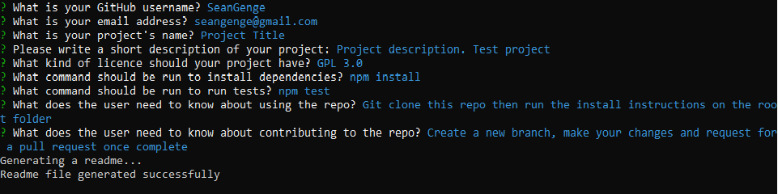
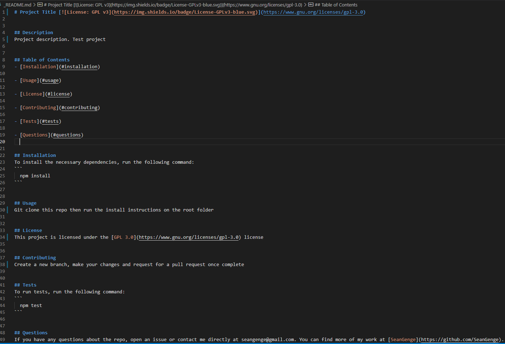
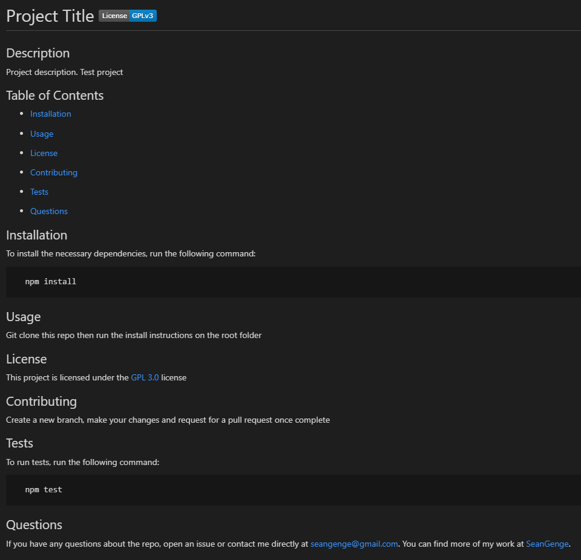

# Readme generator [](https://opensource.org/licenses/MIT)

## Description
Generates a professional readme file
  
## Images
### Questions on the cmd


### The generated Readme file


### Preview of the generated Readme file


## Table of Contents
- [Installation](#installation)
  
- [Usage](#usage)
  
- [License](#license)
  
- [Contributing](#contributing)
  
- [Questions](#questions)

- [Video](#video)
  

## Installation
To install the necessary dependencies, run the following command:
```
  npm install
```
  

## Usage
After git cloning and running the install instructions, type "node index.js" on the root folder in the cmd to start.
  

## License
This project is licensed under the [MIT](https://opensource.org/licenses/MIT) license
  

## Contributing
Nothing
  

## Questions
If you have any questions about the repo, open an issue or contact me directly at seangenge@gmail.com. You can find more of my work at [SeanGenge](https://github.com/SeanGenge).
